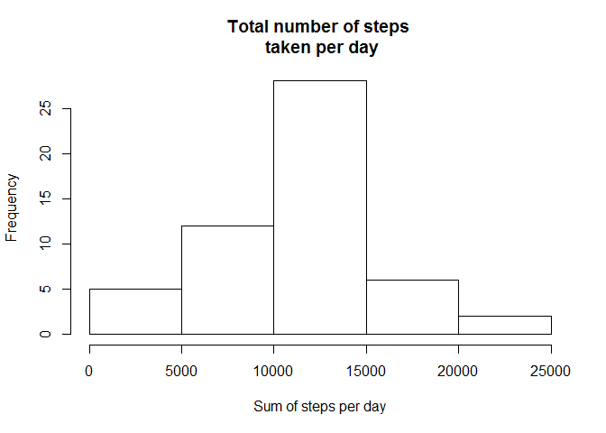
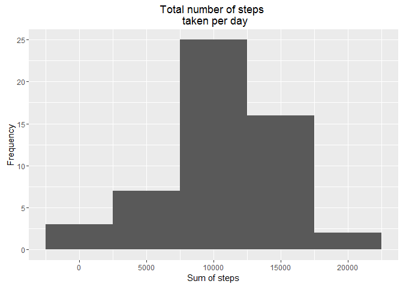
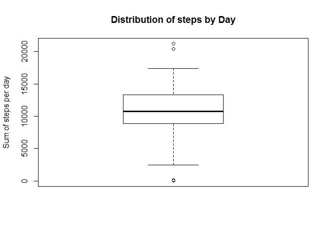
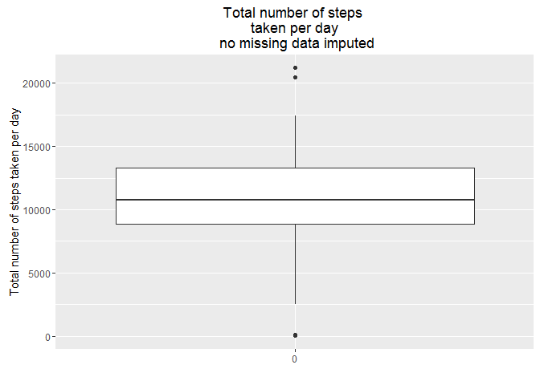
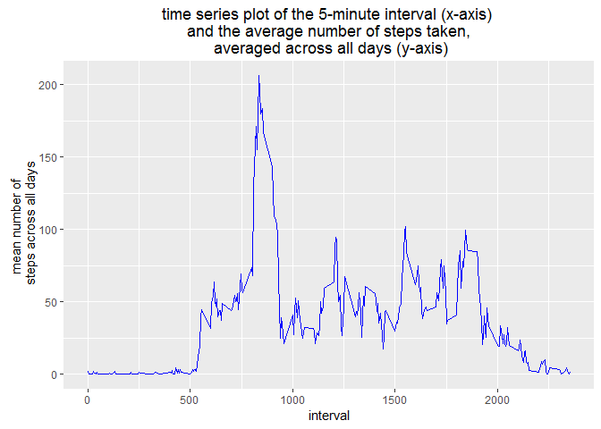
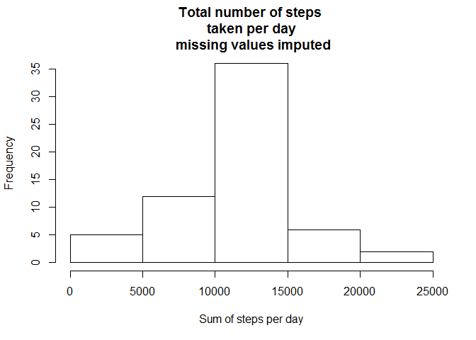
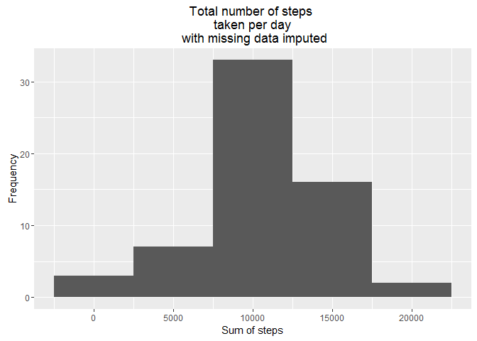

# Reproducible Research: Peer Assessment 1
##Introduction
My gihub rep is here with all necessary code:
[Peer Assignment](https://github.com/brennap3/RepData_PeerAssessment1/blob/master/Roughwork.R)

This assignment also uses dplyr 0.5 (to make use of the coalesce function), which has just been released so if running the code please update your dplyr pacakge, the notes on new features are here:
[Dplyr new features](https://blog.rstudio.org/2016/06/27/dplyr-0-5-0/)

We use the following packages in oour analysis, so lets load them


```r
library(tibble)
library(dtplyr)
```

```
## Warning: package 'dtplyr' was built under R version 3.3.1
```

```r
library(dplyr)
```

```
## Warning: package 'dplyr' was built under R version 3.3.1
```

```r
library(ggplot2)
library(magrittr)
```

## Loading and preprocessing the data
The data is loaded using the read.csv function and a summary is run of the data. From the summary we can see their are some problems with the data, there appears to be missing data. We can see some problems with our dataset, the dimension steps is missing 2304 values.


```r
datafitbit<-read.csv("C:\\Users\\Peter\\Desktop\\RepData_PeerAssessment1\\Data\\activity.csv")
summary(datafitbit)
```

```
##      steps                date          interval     
##  Min.   :  0.00   2012-10-01:  288   Min.   :   0.0  
##  1st Qu.:  0.00   2012-10-02:  288   1st Qu.: 588.8  
##  Median :  0.00   2012-10-03:  288   Median :1177.5  
##  Mean   : 37.38   2012-10-04:  288   Mean   :1177.5  
##  3rd Qu.: 12.00   2012-10-05:  288   3rd Qu.:1766.2  
##  Max.   :806.00   2012-10-06:  288   Max.   :2355.0  
##  NA's   :2304     (Other)   :15840
```

## What is mean total number of steps taken per day?
To do this we will use dplyr we will calculate total number of steps per day, then from this calculate the mean is 10766.19, the median is 10765 and the standard deviation is 4269.18. 


```r
datastepsbydate<-datafitbit %>%
    group_by(date) %>%
      summarise( sum_steps = sum(steps)) %>%
        arrange(sum_steps) %>% as.data.frame()

avgdatastepsbydate<-mean(datastepsbydate$sum_steps,na.rm=TRUE) 
mediandatastepsbydate <-median(datastepsbydate$sum_steps,na.rm=TRUE) 
standard.deviation.datastepsbydate <-sd(datastepsbydate$sum_steps,na.rm=TRUE) 
print(avgdatastepsbydate)
```

```
## [1] 10766.19
```

```r
print(mediandatastepsbydate)
```

```
## [1] 10765
```

```r
print(standard.deviation.datastepsbydate)
```

```
## [1] 4269.18
```

Lets vizualize the distributions in base R and ggplot (using qplot) using a histogram.

```r
hist(datastepsbydate$sum_steps,main="Total number of steps \n taken per day",xlab="Sum of steps per day",ylab="Frequency")
```

<!-- -->

```r
qplot(datastepsbydate$sum_steps,
      geom="histogram",
      main = "Total number of steps \n taken per day",
      binwidth=5000,
      xlab="Sum of steps",
      ylab="Frequency"
      )
```

```
## Warning: Removed 8 rows containing non-finite values (stat_bin).
```

<!-- -->

Lets also see what the distributions look like using a boxplot again in base r and ggplot (q plot), from the boxplots we can see the mean , 25th and 75th percentile (the IQR the inner quartile range) the whiskers extended to  Q1-1.5 X IQR and Q3+1.5XIQR, and there also seems to be a number (3) outliers. The median can be seen at the heavy black line.


```r
boxplot(datastepsbydate$sum_steps,main="Distribution of steps by Day",ylab="Sum of steps per day")
```

<!-- -->

```r
## or in ggplot using qqplot
ggplot(datastepsbydate, aes(factor(0),sum_steps))+geom_boxplot()+
  ggtitle("Total number of steps \n taken per day \n no missing data imputed")+
  xlab("")+
  ylab("Total number of steps taken per day")
```

```
## Warning: Removed 8 rows containing non-finite values (stat_boxplot).
```

<!-- -->


## What is the average daily activity pattern?

We can look at the average daily activity by using the following procedure:
* Aggregate the data with dplyr by Interval and then calculate the mean
* Create a time series plot, using ggplot 


```r
##Make a time series plot (i.e. type = "l") of the 5-minute interval (x-axis) 
##and the average number of steps taken, averaged across all days (y-axis)

datafitbit.avg.daily.activity<-datafitbit %>%
  group_by(interval) %>%
  summarise( mean_steps = mean(steps,na.rm=TRUE)) %>%
  arrange(interval) %>% as.data.frame()

ggplot(datafitbit.avg.daily.activity, aes(x=interval, y=mean_steps)) +
  geom_line(color = "blue")+
  ggtitle("time series plot of the 5-minute interval (x-axis) \n and the average number of steps taken, \n averaged across all days (y-axis)")+
  xlab("interval")+
  ylab("mean number of \n steps across all days")
```

<!-- -->

Next we can identify the interval which has the highest mean number of steps, by selecting the row
from the aggregated dataset the highest average value by index.


```r
f0<-max(datafitbit.avg.daily.activity$mean_steps)

##where does the max average occur

datafitbit.avg.daily.activity[which(datafitbit.avg.daily.activity$mean_steps==eval(f0)),]
```

```
##     interval mean_steps
## 104      835   206.1698
```


## Imputing missing values
Imputation of missing values was done according to the following procedure:
* Calculated the mean by interval
* That mean was steps grouped by interval was then merged to the original dataset
* Coalesce of steps with mean_steps_per_interval was then used to replace missing values in steps with the caclculated averages


```r
datafitbit.per.interval.activity<-datafitbit %>%
  group_by(interval) %>%
  summarise( mean_steps_per_interval = mean(steps,na.rm=TRUE)) %>%
  arrange(interval) %>% as.data.frame()

##now merge on data to original dataset

datafitbit.with.daily.averages<-dplyr::left_join(datafitbit,datafitbit.per.interval.activity,by="interval")

##now replace with mean value where blank

head(datafitbit.with.daily.averages)
```

```
##   steps       date interval mean_steps_per_interval
## 1    NA 2012-10-01        0               1.7169811
## 2    NA 2012-10-01        5               0.3396226
## 3    NA 2012-10-01       10               0.1320755
## 4    NA 2012-10-01       15               0.1509434
## 5    NA 2012-10-01       20               0.0754717
## 6    NA 2012-10-01       25               2.0943396
```

```r
##dplyr::coalesce(as.double(datafitbit.with.daily.averages$steps),datafitbit.with.daily.averages$mean_steps_per_interval)

##test works

##dplyr::coalesce(as.double(datafitbit.with.daily.averages$steps),datafitbit.with.daily.averages$mean_steps_per_interval)

datafitbit.with.daily.averages$steps<-dplyr::coalesce(as.double(datafitbit.with.daily.averages$steps),datafitbit.with.daily.averages$mean_steps_per_interval)

##test works

head(datafitbit.with.daily.averages$steps)
```

```
## [1] 1.7169811 0.3396226 0.1320755 0.1509434 0.0754717 2.0943396
```

```r
summary(datafitbit.with.daily.averages$steps)
```

```
##    Min. 1st Qu.  Median    Mean 3rd Qu.    Max. 
##    0.00    0.00    0.00   37.38   27.00  806.00
```
On imputing the missing data we visualize the data by again creating a histogram in base r and ggplot.


```r
#Make a histogram of the total number of steps taken each day 
head(datafitbit.with.daily.averages)
```

```
##       steps       date interval mean_steps_per_interval
## 1 1.7169811 2012-10-01        0               1.7169811
## 2 0.3396226 2012-10-01        5               0.3396226
## 3 0.1320755 2012-10-01       10               0.1320755
## 4 0.1509434 2012-10-01       15               0.1509434
## 5 0.0754717 2012-10-01       20               0.0754717
## 6 2.0943396 2012-10-01       25               2.0943396
```

```r
datastepswithimputedmissingdatebydate <- datafitbit.with.daily.averages %>%
  group_by(date) %>%
    summarise( sum_steps = sum(steps)) %>%
        arrange(sum_steps) %>% as.data.frame()


hist(datastepswithimputedmissingdatebydate$sum_steps, main="Total number of steps \n taken per day \n missing values imputed", xlab="Sum of steps per day",ylab="Frequency")
```

<!-- -->
The histogram in ggplot.


```r
qplot(datastepswithimputedmissingdatebydate$sum_steps,
      geom="histogram",
      main = "Total number of steps \n taken per day \n with missing data imputed",
      binwidth=5000,
      xlab="Sum of steps",
      ylab="Frequency"
)
```

<!-- -->

##Calculate and report the mean and median total number of steps taken per day. 
The mean and median total number of steps  taken per day based on the dataset with the imputed data replacing the missing data are shown below. 


```r
avg.datasteps.bydate.withimputedmissingdata<-mean(datastepswithimputedmissingdatebydate$sum_steps,na.rm=TRUE) 
median.datasteps.bydate.withimputedmissingdata<-median(datastepswithimputedmissingdatebydate$sum_steps,na.rm=TRUE) 
sd.datasteps.bydate.withimputedmissingdata<-sd(datastepswithimputedmissingdatebydate$sum_steps,na.rm=TRUE)

print(avg.datasteps.bydate.withimputedmissingdata)
```

```
## [1] 10766.19
```

```r
print(median.datasteps.bydate.withimputedmissingdata)
```

```
## [1] 10766.19
```

```r
print(sd.datasteps.bydate.withimputedmissingdata)
```

```
## [1] 3974.391
```


## Are there differences in activity patterns between weekdays and weekends?
