Introduction
------------

Inaddition to the required rubrics for the assignent a number of additional componets were added to help aid the viewr especially regarding the activity patterns at weekends and weekdays, were heatmaps were added. These were found to compliment the pair plots well in giving additional understanding of the activity accross both weekends and weekdays.

**Part 1, Code for reading in the dataset and/or processing the data **

My gihub rep is here with all necessary code: [Peer Assignment](https://github.com/brennap3/RepData_PeerAssessment1/blob/master/Roughwork.R)

This assignment also uses dplyr 0.5 (to make use of the coalesce function), which has just been released so if running the code please update your dplyr pacakge, the notes on new features are here: [Dplyr new features](https://blog.rstudio.org/2016/06/27/dplyr-0-5-0/)

**The document is published to rpubs here, (IMPORTANT click this link to view assignment online) :** [Rpubs](http://rpubs.com/brennap3/193651)

**librarys and packages used**

We use the following packages in oour analysis, so lets load them

``` r
library(tibble)
library(dtplyr)
library(dplyr)
library(ggplot2)
library(magrittr)
library(moments)
library(lubridate)
library(RColorBrewer)

options(width = 200)
```

Loading and preprocessing the data
----------------------------------

The data is loaded using the read.csv function and a summary is run of the data. From the summary we can see their are some problems with the data, there appears to be missing data. We can see some problems with our dataset, the dimension steps is missing 2304 values.

``` r
datafitbit<-read.csv("C:\\Users\\Peter\\Desktop\\RepData_PeerAssessment1\\Data\\activity.csv")
knitr::kable(summary(datafitbit))
```

|     |      steps     |       date      |    interval    |
|-----|:--------------:|:---------------:|:--------------:|
|     |   Min. : 0.00  | 2012-10-01: 288 |   Min. : 0.0   |
|     |  1st Qu.: 0.00 | 2012-10-02: 288 | 1st Qu.: 588.8 |
|     |  Median : 0.00 | 2012-10-03: 288 | Median :1177.5 |
|     |  Mean : 37.38  | 2012-10-04: 288 |  Mean :1177.5  |
|     | 3rd Qu.: 12.00 | 2012-10-05: 288 | 3rd Qu.:1766.2 |
|     |  Max. :806.00  | 2012-10-06: 288 |  Max. :2355.0  |
|     |   NA's :2304   |  (Other) :15840 |       NA       |

**Part 3, What is mean, median and sd of total number of steps taken per day?**

**Mean and median number of steps taken each day**

To do this we will use dplyr we will calculate total number of steps per day, then from this calculate the mean is 10766.19, the median is 10765 and the standard deviation is 4269.18.

``` r
datastepsbydate<-datafitbit %>%
  group_by(date) %>%
  summarise( sum_steps = sum(steps)) %>%
  arrange(sum_steps) %>% as.data.frame()

avgdatastepsbydate<-mean(datastepsbydate$sum_steps,na.rm=TRUE) 
mediandatastepsbydate <-median(datastepsbydate$sum_steps,na.rm=TRUE) 
standard.deviation.datastepsbydate <-sd(datastepsbydate$sum_steps,na.rm=TRUE) 
print("mean number of steps taken per day")
```

    ## [1] "mean number of steps taken per day"

``` r
print(avgdatastepsbydate)
```

    ## [1] 10766.19

``` r
print("median number of steps taken per day")
```

    ## [1] "median number of steps taken per day"

``` r
print(mediandatastepsbydate)
```

    ## [1] 10765

``` r
print("standard deviation of number of steps taken per day")
```

    ## [1] "standard deviation of number of steps taken per day"

``` r
print(standard.deviation.datastepsbydate)
```

    ## [1] 4269.18

**Part 2, Histogram of the total number of steps taken each day, in ggplot and base r**

Lets vizualize the distributions in base R and ggplot (using qplot) using a histogram.

``` r
hist(datastepsbydate$sum_steps,main="Total number of steps \n taken per day",xlab="Sum of steps per day",ylab="Frequency")
```


``` r
qplot(datastepsbydate$sum_steps,
      geom="histogram",
      main = "Total number of steps \n taken per day",
      binwidth=5000,
      xlab="Sum of steps",
      ylab="Frequency"
)
```

    ## Warning: Removed 8 rows containing non-finite values (stat_bin).

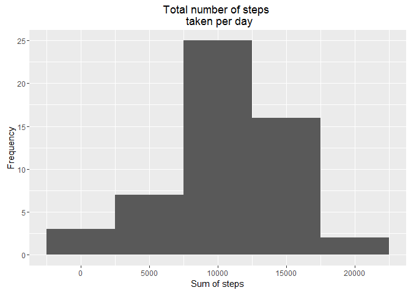

Lets also see what the distributions look like using a boxplot again in base r and ggplot (q plot), from the boxplots we can see the mean , 25th and 75th percentile (the IQR the inner quartile range) the whiskers extended to Q1-1.5 X IQR and Q3+1.5XIQR, and there also seems to be a number (3) outliers. The median can be seen at the heavy black line.

``` r
boxplot(datastepsbydate$sum_steps,main="Distribution of steps by Day",ylab="Sum of steps per day")
```

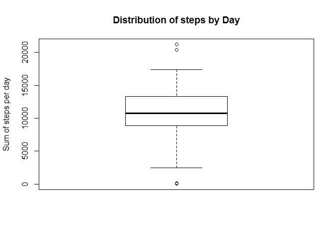

``` r
## or in ggplot using qqplot
ggplot(datastepsbydate, aes(factor(0),sum_steps))+geom_boxplot()+
  ggtitle("Total number of steps \n taken per day \n no missing data imputed")+
  xlab("")+
  ylab("Total number of steps taken per day")
```

    ## Warning: Removed 8 rows containing non-finite values (stat_boxplot).

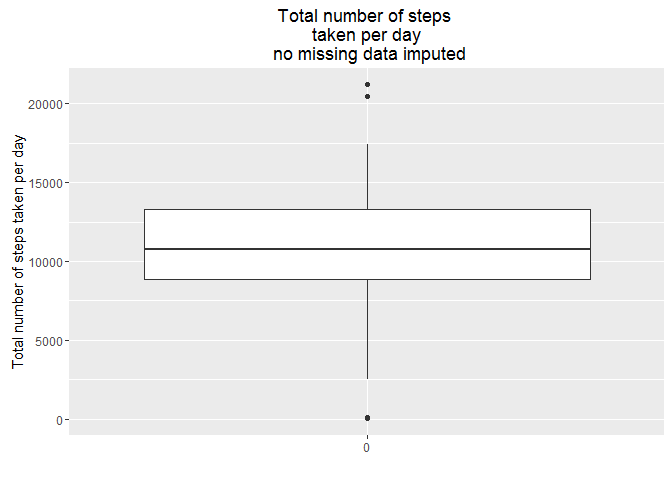

What is the average daily activity pattern?
-------------------------------------------

We can look at the average daily activity by using the following procedure:

-   Aggregate the data with dplyr by Interval and then calculate the mean and median
-   Create a time series plot, using ggplot

**Part 4, Time series plot of the average number of steps taken**

``` r
##Make a time series plot (i.e. type = "l") of the 5-minute interval (x-axis) 
##and the average number of steps taken, averaged across all days (y-axis)

datafitbit.avg.daily.activity<-datafitbit %>%
  group_by(interval) %>%
  summarise( mean_steps = mean(steps,na.rm=TRUE)) %>%
  arrange(interval) %>% as.data.frame()

ggplot(datafitbit.avg.daily.activity, aes(x=interval, y=mean_steps)) +
  geom_line(color = "blue")+
  ggtitle("time series plot of the 5-minute interval (x-axis) \n and the average number of steps taken, \n averaged across all days (y-axis)")+
  xlab("interval")+
  ylab("mean number of \n steps across all days")
```

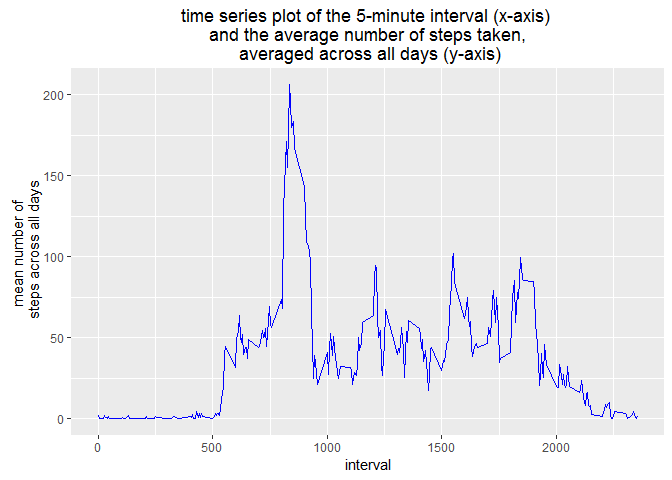

**Part 5, The 5-minute interval that, on average, contains the maximum number of steps**

Next we can identify the interval which has the highest mean number of steps, by selecting the row from the aggregated dataset the highest average value by index.

``` r
f0<-max(datafitbit.avg.daily.activity$mean_steps)

##where does the max average occur

datafitbit.avg.daily.activity[which(datafitbit.avg.daily.activity$mean_steps==eval(f0)),]
```

    ##     interval mean_steps
    ## 104      835   206.1698

Imputing missing values
-----------------------

**Part 6, Code to describe and show a strategy for imputing missing data**

Imputation of missing values was done according to the following procedure:

-   Calculated the mean by interval.
-   That mean was steps grouped by interval was then merged to the original dataset.
-   Coalesce of steps with mean\_steps\_per\_interval was then used to replace missing values in steps with the caclculated averages.

``` r
datafitbit.per.interval.activity<-datafitbit %>%
      group_by(interval) %>%
        summarise( mean_steps_per_interval = mean(steps,na.rm=TRUE)) %>%
            arrange(interval) %>% as.data.frame()

##now merge on data to original dataset

datafitbit.with.daily.averages<-dplyr::left_join(datafitbit,datafitbit.per.interval.activity,by="interval")

##now replace with mean value where blank

knitr::kable(head(datafitbit.with.daily.averages))
```

|  steps| date       |  interval|  mean\_steps\_per\_interval|
|------:|:-----------|---------:|---------------------------:|
|     NA| 2012-10-01 |         0|                   1.7169811|
|     NA| 2012-10-01 |         5|                   0.3396226|
|     NA| 2012-10-01 |        10|                   0.1320755|
|     NA| 2012-10-01 |        15|                   0.1509434|
|     NA| 2012-10-01 |        20|                   0.0754717|
|     NA| 2012-10-01 |        25|                   2.0943396|

``` r
##dplyr::coalesce(as.double(datafitbit.with.daily.averages$steps),datafitbit.with.daily.averages$mean_steps_per_interval)

##test works

##dplyr::coalesce(as.double(datafitbit.with.daily.averages$steps),datafitbit.with.daily.averages$mean_steps_per_interval)

datafitbit.with.daily.averages$steps<-dplyr::coalesce(as.double(datafitbit.with.daily.averages$steps),datafitbit.with.daily.averages$mean_steps_per_interval)

##test works
```

From the summary tables we can now see there is no missing data

``` r
knitr::kable(head(datafitbit.with.daily.averages))
```

|      steps| date       |  interval|  mean\_steps\_per\_interval|
|----------:|:-----------|---------:|---------------------------:|
|  1.7169811| 2012-10-01 |         0|                   1.7169811|
|  0.3396226| 2012-10-01 |         5|                   0.3396226|
|  0.1320755| 2012-10-01 |        10|                   0.1320755|
|  0.1509434| 2012-10-01 |        15|                   0.1509434|
|  0.0754717| 2012-10-01 |        20|                   0.0754717|
|  2.0943396| 2012-10-01 |        25|                   2.0943396|

``` r
knitr::kable(summary(datafitbit.with.daily.averages))
```

|     |      steps     |       date      |    interval    | mean\_steps\_per\_interval |
|-----|:--------------:|:---------------:|:--------------:|:---------------------------|
|     |   Min. : 0.00  | 2012-10-01: 288 |   Min. : 0.0   | Min. : 0.000               |
|     |  1st Qu.: 0.00 | 2012-10-02: 288 | 1st Qu.: 588.8 | 1st Qu.: 2.486             |
|     |  Median : 0.00 | 2012-10-03: 288 | Median :1177.5 | Median : 34.113            |
|     |  Mean : 37.38  | 2012-10-04: 288 |  Mean :1177.5  | Mean : 37.383              |
|     | 3rd Qu.: 27.00 | 2012-10-05: 288 | 3rd Qu.:1766.2 | 3rd Qu.: 52.835            |
|     |  Max. :806.00  | 2012-10-06: 288 |  Max. :2355.0  | Max. :206.170              |
|     |       NA       |  (Other) :15840 |       NA       | NA                         |

**Part 7, Histogram of the total number of steps taken each day after missing values are imputed**

On imputing the missing data we visualize the data by again creating a histogram in base r and ggplot.

``` r
#Make a histogram of the total number of steps taken each day 
head(datafitbit.with.daily.averages)
```

    ##       steps       date interval mean_steps_per_interval
    ## 1 1.7169811 2012-10-01        0               1.7169811
    ## 2 0.3396226 2012-10-01        5               0.3396226
    ## 3 0.1320755 2012-10-01       10               0.1320755
    ## 4 0.1509434 2012-10-01       15               0.1509434
    ## 5 0.0754717 2012-10-01       20               0.0754717
    ## 6 2.0943396 2012-10-01       25               2.0943396

``` r
datastepswithimputedmissingdatebydate <- datafitbit.with.daily.averages %>%
  group_by(date) %>%
  summarise( sum_steps = sum(steps)) %>%
  arrange(sum_steps) %>% as.data.frame()

hist(datastepswithimputedmissingdatebydate$sum_steps, main="Total number of steps \n taken per day \n missing values imputed", xlab="Sum of steps per day",ylab="Frequency")
```

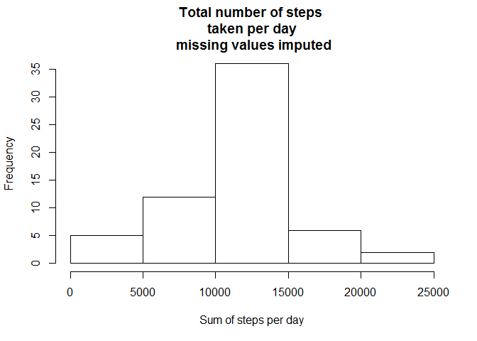

The histogram in ggplot.

``` r
qplot(datastepswithimputedmissingdatebydate$sum_steps,
      geom="histogram",
      main = "Total number of steps \n taken per day \n with missing data imputed",
      binwidth=5000,
      xlab="Sum of steps",
      ylab="Frequency"
)
```

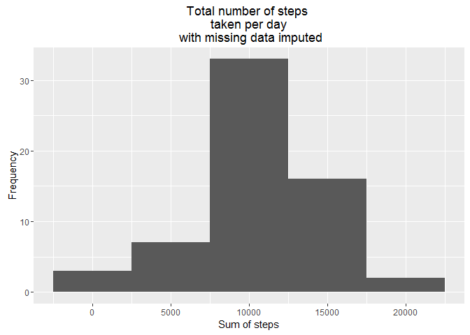

Calculate and report the mean and median total number of steps taken per day, with the imputed missing data.
------------------------------------------------------------------------------------------------------------

The mean and median total number of steps taken per day based on the dataset with the imputed data replacing the missing data are shown below.

``` r
avg.datasteps.bydate.withimputedmissingdata<-mean(datastepswithimputedmissingdatebydate$sum_steps,na.rm=TRUE) 
median.datasteps.bydate.withimputedmissingdata<-median(datastepswithimputedmissingdatebydate$sum_steps,na.rm=TRUE) 
sd.datasteps.bydate.withimputedmissingdata<-sd(datastepswithimputedmissingdatebydate$sum_steps,na.rm=TRUE)

print(avg.datasteps.bydate.withimputedmissingdata)
```

    ## [1] 10766.19

``` r
print(median.datasteps.bydate.withimputedmissingdata)
```

    ## [1] 10766.19

``` r
print(sd.datasteps.bydate.withimputedmissingdata)
```

    ## [1] 3974.391

Do these values differ from the estimates from the first part of the assignment?
--------------------------------------------------------------------------------

The mean and median do not differ much but from the above data the standard deviation does differ. To get a better understanding of the changes to the data we create a series of distribution plots of mean-steps taken on the imputed missing values.

To answer the question do these distributions (without missing data imputed and with missing data) differ we create a number of side by side plotsshowing the distibutions of (a) The dataset without the missing data and (b) with the missing data. We use two types of distribution plots to do this;

1.  Histograms.
2.  Boxplots.

``` r
##Do these values differ from the estimates from the first part of the assignment? 
library(cowplot)
```

    ## Warning: package 'cowplot' was built under R version 3.3.1

``` r
ap<-qplot(datastepsbydate$sum_steps,
          geom="histogram",
          main = "Total number of steps \n taken per day",
          binwidth=5000,
          xlab="Sum of steps",
          ylab="Frequency"
)

bp<-qplot(datastepswithimputedmissingdatebydate$sum_steps,
          geom="histogram",
          main = "Total number of steps \n taken per day \n with missing data imputed",
          binwidth=5000,
          xlab="Sum of steps",
          ylab="Frequency"
)

plot_grid(ap, bp, ncol = 2, nrow = 1)
```

    ## Warning: Removed 8 rows containing non-finite values (stat_bin).

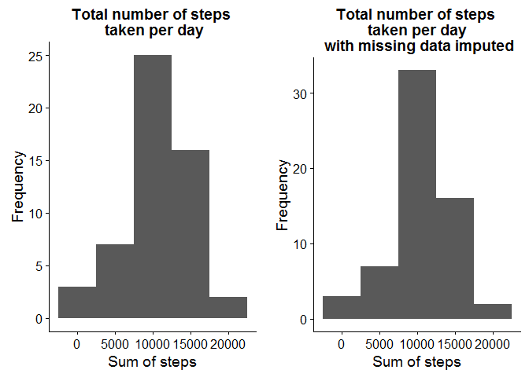

The boxplots.

``` r
abxpwithmiss<-ggplot(datastepswithimputedmissingdatebydate, aes(factor(0),sum_steps))+geom_boxplot()+
  ggtitle("Total number of steps \n taken per day \n with missing data imputed")+
  xlab("")+
  ylab("Total number of steps taken per day")

abxpw<-ggplot(datastepsbydate, aes(factor(0),sum_steps))+geom_boxplot()+
  ggtitle("Total number of steps \n taken per day")+
  xlab("")+
  ylab("Total number of steps taken per day")


plot_grid(abxpw,abxpwithmiss,  ncol = 2, nrow = 1)
```

    ## Warning: Removed 8 rows containing non-finite values (stat_boxplot).

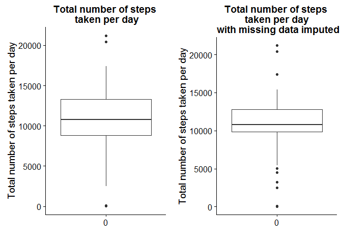

We also calculate the summary statisitics for the dataset withou imputed missing data and with imputed missing data.The summary statistics are shown below:

**Summary statistics**

``` r
knitr::kable(summary(datastepsbydate))
```

|     |      date     |   sum\_steps  |
|-----|:-------------:|:-------------:|
|     | 2012-10-01: 1 |   Min. : 41   |
|     | 2012-10-02: 1 | 1st Qu.: 8841 |
|     | 2012-10-03: 1 | Median :10765 |
|     | 2012-10-04: 1 |  Mean :10766  |
|     | 2012-10-05: 1 | 3rd Qu.:13294 |
|     | 2012-10-06: 1 |  Max. :21194  |
|     |  (Other) :55  |    NA's :8    |

``` r
knitr::kable(summary(datastepswithimputedmissingdatebydate))
```

|     |      date     |   sum\_steps  |
|-----|:-------------:|:-------------:|
|     | 2012-10-01: 1 |   Min. : 41   |
|     | 2012-10-02: 1 | 1st Qu.: 9819 |
|     | 2012-10-03: 1 | Median :10766 |
|     | 2012-10-04: 1 |  Mean :10766  |
|     | 2012-10-05: 1 | 3rd Qu.:12811 |
|     | 2012-10-06: 1 |  Max. :21194  |
|     |  (Other) :55  |       NA      |

We can see from examining the distributions (with both boxplots and histograms) and looking at the summary statistics that with the imputed missing data, that the IQR has increased, but there does appear to beslightly more left skew in our data and also our distribution with the imputed data appears to be more peaked. We will calculate skew and also the kurtosis the peakedness of the distribution.

``` r
summary(datastepsbydate)
```

    ##          date      sum_steps    
    ##  2012-10-01: 1   Min.   :   41  
    ##  2012-10-02: 1   1st Qu.: 8841  
    ##  2012-10-03: 1   Median :10765  
    ##  2012-10-04: 1   Mean   :10766  
    ##  2012-10-05: 1   3rd Qu.:13294  
    ##  2012-10-06: 1   Max.   :21194  
    ##  (Other)   :55   NA's   :8

``` r
summary(datastepswithimputedmissingdatebydate)
```

    ##          date      sum_steps    
    ##  2012-10-01: 1   Min.   :   41  
    ##  2012-10-02: 1   1st Qu.: 9819  
    ##  2012-10-03: 1   Median :10766  
    ##  2012-10-04: 1   Mean   :10766  
    ##  2012-10-05: 1   3rd Qu.:12811  
    ##  2012-10-06: 1   Max.   :21194  
    ##  (Other)   :55

The skewness and the kurtosis of the original dataset and the dateaset with the imputed missing data are calculated below:

**With the Missing Data**

The skewness value caculated is negative (-0.332957), indicating the distribution is skewed left which we could observe from distribution plots, we can also see from the kurtosis values that distribution is somewhat more peaked (when compared to a normal distribution)

``` r
library(moments)
skewness(datastepsbydate$sum_steps,na.rm=T)
```

    ## [1] -0.3103567

``` r
kurtosis(datastepsbydate$sum_steps,na.rm=T)
```

    ## [1] 3.730805

**With the imputed data**

When we again measure the skewness and kurtosis of the dataset, we slightly higher negative skew (skewed left), but the Kurtosis value is much higher indicating that the distribution is more peaked. Again on examining the previously calculated distribution plots we can confirm this observation.

With the imputed missing Data:

``` r
library(moments)
skewness(datastepswithimputedmissingdatebydate$sum_steps,na.rm=T) ##no need to do this they (NA's) should be removed
```

    ## [1] -0.332957

``` r
kurtosis(datastepswithimputedmissingdatebydate$sum_steps,na.rm=T) ##no need to do this they  (NA's)  should be removed
```

    ## [1] 4.293945

**Testing for normality of the distribution of the average number of steps on the data with the missing values and no imputed data**

Kolgomorov smirnoff test is used to to compare the disttribution to a normaldistribution of same mean and standard deviation, along with a more formal test using the Shapiro Wilks test (on the distribution with the missing data) using the calculated standard deviation and mean from the previously calculated data. From the Shapiro Wilks test we can see that the sample comes from a normal distribution. Also the q-q plot is appproxiamtely staight.

``` r
ks.test(datastepsbydate$sum_steps, "pnorm", mean(datastepsbydate$sum_steps), sd(datastepsbydate$sum_steps)) ##with imputed missing values
```

    ## 
    ##  One-sample Kolmogorov-Smirnov test
    ## 
    ## data:  datastepsbydate$sum_steps
    ## D = NA, p-value = NA
    ## alternative hypothesis: two-sided

``` r
##null hypothesis: the null hypothesis that the true distribution function of x is equal to, not less than or not greater than the hypothesized distribution function (one-sample case) or the distribution function of y (two-sample case), respectively
## the test is inconclusive thought we could not reject the null hypothesis at 0.05 level
##so lets perform a shapiro wilks test on our data
shapiro.test(datastepsbydate$sum_steps)
```

    ## 
    ##  Shapiro-Wilk normality test
    ## 
    ## data:  datastepsbydate$sum_steps
    ## W = 0.96582, p-value = 0.1326

``` r
##so from are test we fail to reject the null hypothesis that the sample data does not comes from a normal distribution
##and is infact from a normal distribution
##Finally we plot a qqnorm plot of our data, This is a plot 
qqnorm(datastepsbydate$sum_steps, main="Quantile Quantile plot of \n number of step with missing data")
```

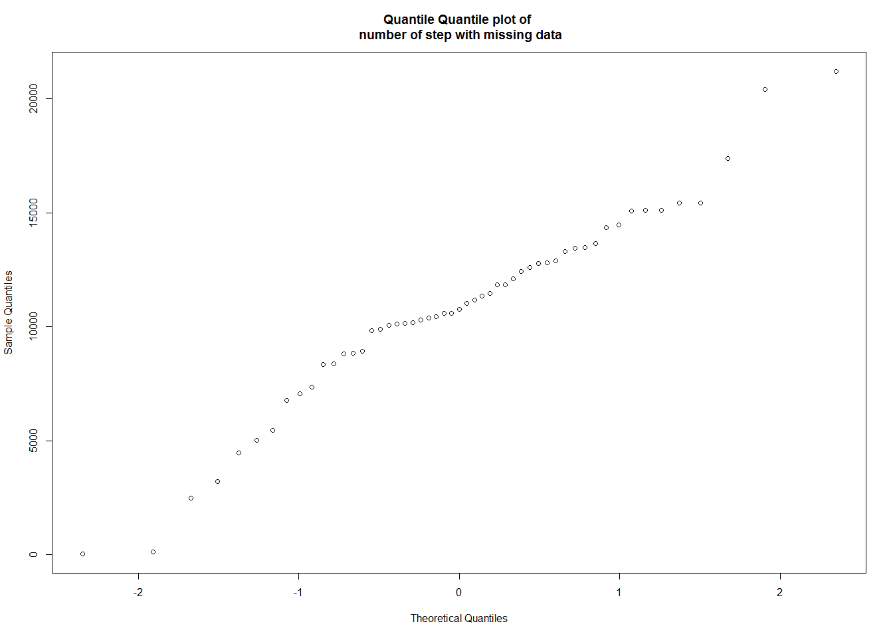

``` r
## again the plot is fairly straight this would indicate normality
##The q-q plot provides a visual aid in comparing  the sample quantiles 
##to the corresponding theoretical quantiles.  
##if the points in a q-q plot deviate from a straight line, 
##then the assumed distribution is called into question 
##in our case this would be the normal distribution.
```

**Testing for normality of the distribution of the average number of steps on the data with the imputed values**

Kolgomorov smirnoff test is used to to compare the disttribution to a normaldistribution of same mean and standard deviation, along with a more formal test using the shapiro wilks test (on the distribution with the missing data) using the calculated standard deviation and mean from the previously calculated data. From the Shapiro Wilks test we can see that the sample did not come from a normal distribution. This is also apparent in the q-q plot as the line is not straight would call into question whether the data is normally distributed.

``` r
ks.test(datastepswithimputedmissingdatebydate$sum_steps, "pnorm", mean(datastepswithimputedmissingdatebydate$sum_steps), sd(datastepswithimputedmissingdatebydate$sum_steps)) ##with imputed missing values
```

    ## Warning in ks.test(datastepswithimputedmissingdatebydate$sum_steps, "pnorm", : ties should not be present for the Kolmogorov-Smirnov test

    ## 
    ##  One-sample Kolmogorov-Smirnov test
    ## 
    ## data:  datastepswithimputedmissingdatebydate$sum_steps
    ## D = 0.15991, p-value = 0.08832
    ## alternative hypothesis: two-sided

``` r
##null hypothesis: the null hypothesis that the true distribution function of x is equal to, not less than or not greater than the hypothesized distribution function (one-sample case) or the distribution function of y (two-sample case), respectively
## the test is inconclusive thought we could not reject the null hypothesis at 0.05 level
##so lets perform a shapiro wilks test on our data
shapiro.test(datastepswithimputedmissingdatebydate$sum_steps)
```

    ## 
    ##  Shapiro-Wilk normality test
    ## 
    ## data:  datastepswithimputedmissingdatebydate$sum_steps
    ## W = 0.94538, p-value = 0.008739

``` r
##at the critical value level of 0.05 we would reject the null hypothesis that the sample comes from a null distribution

qqnorm(datastepswithimputedmissingdatebydate$sum_steps, main="Quantile Quantile plot of \n number of step with imputed data")
```


``` r
## again the plot is fairly straight this would indicate normality
##The q-q plot provides a visual aid in comparing  the sample quantiles 
##to the corresponding theoretical quantiles.  
##if the points in a q-q plot deviate from a straight line, 
##then the assumed distribution is called into question 
##in our case this does appear to be  normal distributed data.
```

Are there differences in activity patterns between weekdays and weekends?
-------------------------------------------------------------------------

To calculate whether there are differences in behaviour we carry out the following procedure:

1.  Calculate the weekday from the date by using lubridate.
2.  Calculate mean number of step by day of week and interval.
3.  Create a ggplotpairplot visualizing the number of steps taken at the weekend and during the week.
4.  Create a ggplot heatmap visualizing the number of steps taken per day.
5.  Create a ggplot heatmap visualizing the number of steps taken at the weekend and during the week..

**Part 8, The panel plot of activity during the week and at the weekend**

The pair plot show different behaviour during the week and at the weekend, at the weekends we can see three definite differences: 1. During the week between 8 and 9:30 AM there is more activity when compared to the weekend. 2. During the weekend there is much more activity during the late morning to mid afternoon (10:00 AM to 15:00 AM). 3. After mid afternoon there is much more activity on weekends tailing off later than weekdays

``` r
datafitbit['Week_Day']<-lubridate::wday(datafitbit$date,label=T)

## we will use the dataset with out the imputed data
##inspired by https://rpubs.com/daattali/heatmapsGgplotVsLattice

datafitbit$Week_day_Week_End <- sapply(datafitbit$Week_Day, function(x) switch(as.character(x),
                                                                               "Sun" = "Weekend",
                                                                               "Sat" = "Weekend",
                                                                               "Weekday"
))

datafitbit.per.interval.activity.by.weekday.weekend<-datafitbit %>%
  group_by(interval,Week_day_Week_End) %>%
  summarise( mean_steps_per_interval = mean(steps,na.rm=TRUE)) %>%
  arrange(Week_day_Week_End,interval) %>% as.data.frame()


datafitbit.per.interval.activity.by.weekday <- datafitbit.per.interval.activity.by.weekday.weekend %>% filter(Week_day_Week_End=="Weekday")
datafitbit.per.interval.activity.by.weekend <- datafitbit.per.interval.activity.by.weekday.weekend %>% filter(Week_day_Week_End=="Weekend")

###


gpwkday<-ggplot(datafitbit.per.interval.activity.by.weekday, aes(x=interval, y=mean_steps_per_interval)) +
  geom_line(color = "blue")+
  scale_y_continuous(limits = c(0, 300))+
  ggtitle("time series plot of the 5-minute interval (x-axis) \n and the average number of steps taken, \n averaged across all Weekdays (y-axis)")+
  xlab("interval")+
  ylab("mean number of \n steps across all weekdays")

gpwkend<-ggplot(datafitbit.per.interval.activity.by.weekend, aes(x=interval, y=mean_steps_per_interval)) +
  geom_line(color = "red")+
  scale_y_continuous(limits = c(0, 300))+
  ggtitle("time series plot of the 5-minute interval (x-axis) \n and the average number of steps taken, \n averaged across all Weekend days (y-axis)")+
  xlab("interval")+
  ylab("mean number of \n steps across all weekend days \n (Saturday,Sunday)")

plot_grid(gpwkday, gpwkend, ncol = 1, nrow = 2)
```

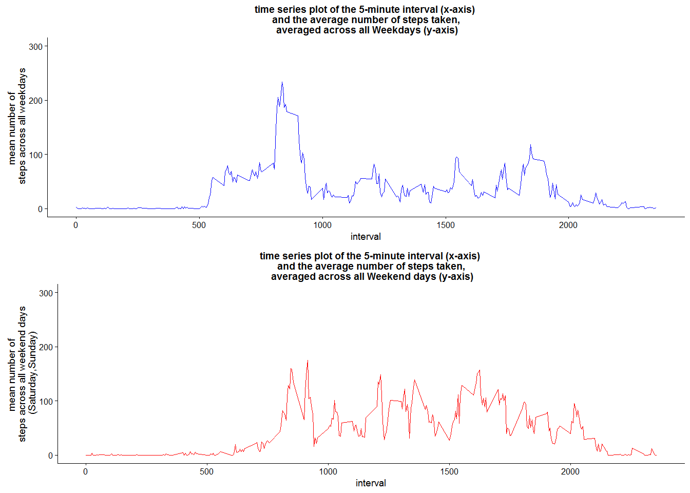

**Heatmaps, Days of week used to visualize activity**

From this analysis its quite clear that peak activity during oocurs between 8-9 am on weekdays (Monday to Friday) and that on weekends peak activity occurs much later in the day. The code to execute the analysis is shown below.

``` r
head(datafitbit)
```

    ##   steps       date interval Week_Day Week_day_Week_End
    ## 1    NA 2012-10-01        0      Mon           Weekday
    ## 2    NA 2012-10-01        5      Mon           Weekday
    ## 3    NA 2012-10-01       10      Mon           Weekday
    ## 4    NA 2012-10-01       15      Mon           Weekday
    ## 5    NA 2012-10-01       20      Mon           Weekday
    ## 6    NA 2012-10-01       25      Mon           Weekday

``` r
datafitbit['Week_Day']<-lubridate::wday(datafitbit$date,label=T)

## we will use the dataset with out the imputed data

datafitbit.per.interval.activity.by.weekday<-datafitbit %>%
  group_by(interval,Week_Day) %>%
  summarise( mean_steps_per_interval = mean(steps,na.rm=TRUE)) %>%
  arrange(Week_Day,interval) %>% as.data.frame()

##head(datafitbit.per.interval.activity.by.weekday)


jBuPuFun <- colorRampPalette(brewer.pal(n = 9, "BuPu"))
paletteSize <- 256
jBuPuPalette <- jBuPuFun(paletteSize)

ggplot(datafitbit.per.interval.activity.by.weekday, aes(x = interval, y = Week_Day, fill = mean_steps_per_interval)) +
  theme(axis.text.x = element_text(angle = 90, hjust = 1, vjust = 0.5)) +
  geom_tile() +
  ggtitle("Heatmap of mean number of steps \n by time and day of Week") +
  xlab("Time of day \n 24 hour clock")+
  ylab("Day") +
  scale_fill_gradient2(low = jBuPuPalette[1],
                       mid = jBuPuPalette[paletteSize/2],
                       high = jBuPuPalette[paletteSize],
                       midpoint = max(datafitbit.per.interval.activity.by.weekday$mean_steps_per_interval))
```

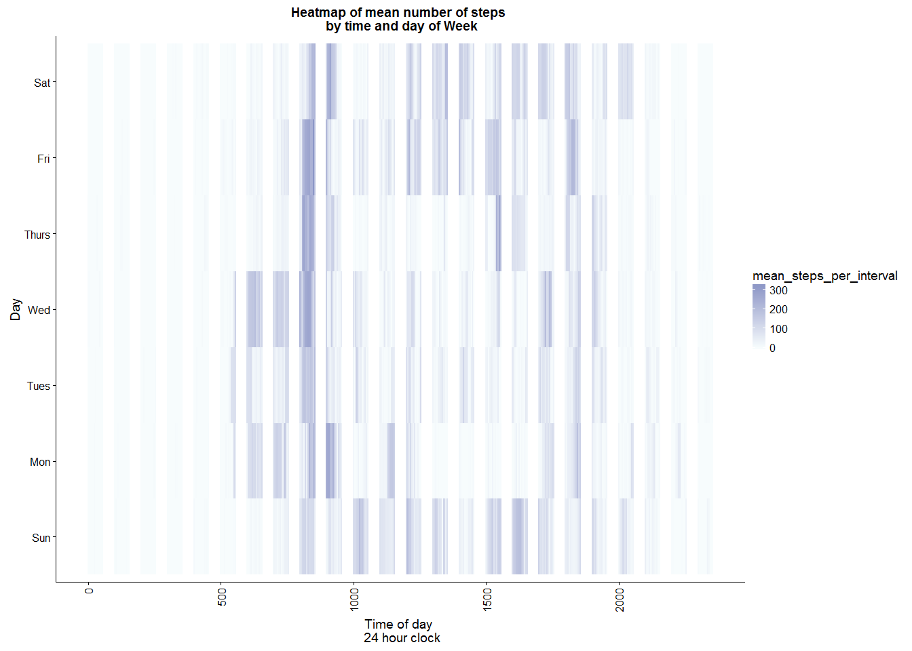

**Heatmaps, Weekends and Weekdays**

Again if we code the days of week as weekend (Saturday, Sunday) and again plot the x -axis (Monday, Tuesday,Wednesday,Thursday,Friday) as time of day, the pattern is somewhat clearer, on weekdays the most activity is happening between 8 am and 9 am while on weekends activity is occuring much later.

``` r
datafitbit$Week_day_Week_End <- sapply(datafitbit$Week_Day, function(x) switch(as.character(x),
                                                                               "Sun" = "Weekend",
                                                                               "Sat" = "Weekend",
                                                                               "Weekday"
))

datafitbit.per.interval.activity.by.weekday.weekend<-datafitbit %>%
  group_by(interval,Week_day_Week_End) %>%
  summarise( mean_steps_per_interval = mean(steps,na.rm=TRUE)) %>%
  arrange(Week_day_Week_End,interval) %>% as.data.frame()


ggplot(datafitbit.per.interval.activity.by.weekday.weekend, aes(x = interval, y = Week_day_Week_End, fill = mean_steps_per_interval)) +
  theme(axis.text.x = element_text(angle = 90, hjust = 1, vjust = 0.5)) +
  geom_tile() +
  ggtitle("Heatmap of mean number of steps \n by time and day of Week type")+
  xlab("Time of day \n 24 hour clock")+
  ylab("Day") +
  scale_fill_gradient2(low = jBuPuPalette[1],
                       mid = jBuPuPalette[paletteSize/2],
                       high = jBuPuPalette[paletteSize],
                       midpoint = (max(datafitbit.per.interval.activity.by.weekday$mean_steps_per_interval) + min(datafitbit.per.interval.activity.by.weekday$mean_steps_per_interval)) / 2,
                       name = "Mean steps per interval \n per day of week type")
```

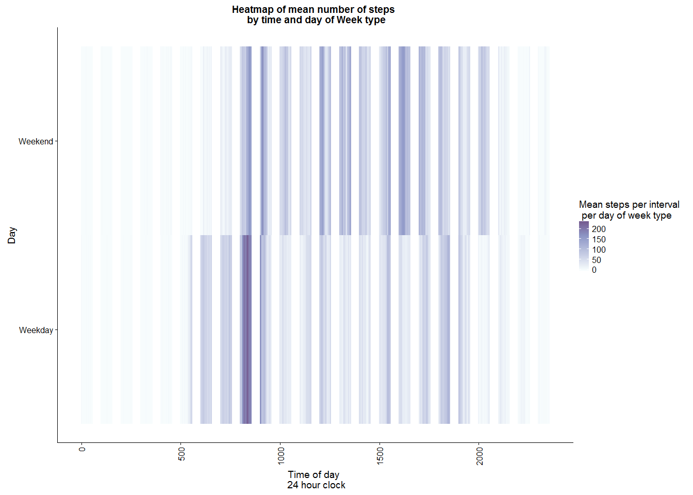
